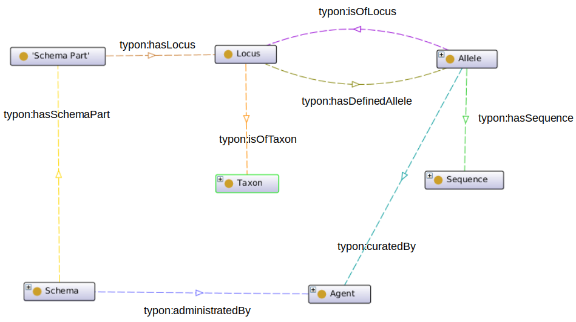
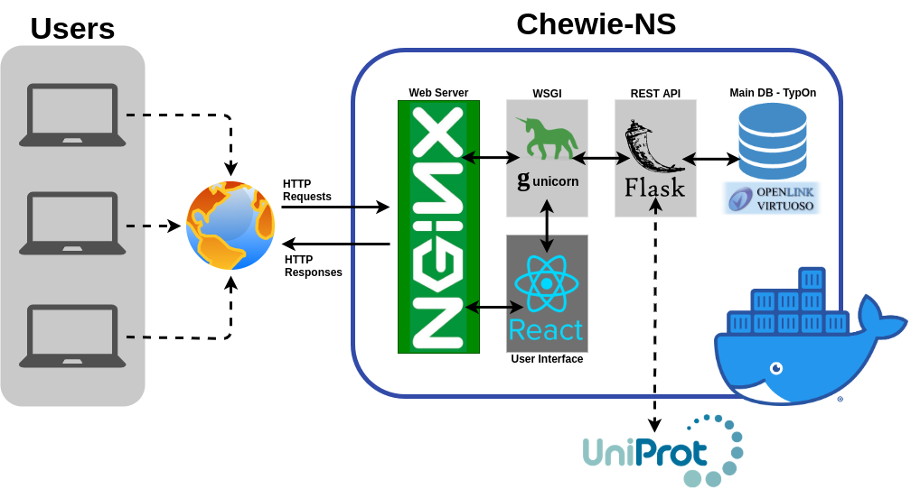

Overview
========

Chewie-NS is a Nomenclature Server based on the 
`TypOn ontology <https://jbiomedsem.biomedcentral.com/articles/10.1186/2041-1480-5-43>`_ 
and integrates with the `chewBBACA suite <https://github.com/B-UMMI/chewBBACA>`_ 
to provide a centralized service to download and or update gene-by-gene schemas, 
allowing the easy sharing of results, while ensuring the reproducibility and 
consistency of these steps.

    Figure 1: TypOn ontology. Adapted from `Vaz et al, 2014 <https://jbiomedsem.biomedcentral.com/articles/10.1186/2041-1480-5-43>`_.

   

Motivation
----------

Current typing methods suffer from standardization issues that become clear when 
trying to compare results from distinct tools but, most importantly, when a 
meaningful comparison is needed between results obtained with the same tool.

We have previously proposed a suite, `chewBBACA <https://github.com/B-UMMI/chewBBACA>`_, 
that allows the creation of gene-by-gene schemas and determination of allelic 
profiles from assembled draft genomes. The results obtained using this suite may 
not be immediatly comparable due to the use of different parameter that hinder 
the comparison and shareability of the results.

To tackle these issues we developed Chewie-NS, a Nomenclature Server based on the 
`TypOn ontology <https://jbiomedsem.biomedcentral.com/articles/10.1186/2041-1480-5-43>`_ 
and integrates with the `chewBBACA suite <https://github.com/B-UMMI/chewBBACA>`_ 
to provide a centralized service to manage gene-by-gene typing schemas and provide a 
common nomenclature for allele calling, ensuring the the reproducibility of the 
analyses and the privacy of the data.
 

Implementation
--------------

Chewie-NS provides a public and centralised web service, separated into 
a back end to handle command line and server requests and a front end that 
allows a user-friendly interaction with the service.

A diagram of the implementation of Chewie-NS is displayed below:

    Figure 2: Chewie-NS implementation.

Backend
:::::::

The back-end of the service uses Virtuoso, a triple store database management system,
based on the `TypOn ontology <https://jbiomedsem.biomedcentral.com/articles/10.1186/2041-1480-5-43>`_.

A `REST API <https://restfulapi.net/>`_, built with `Flask <https://flask.palletsprojects.com/en/1.1.x/>`_, 
a Python web development microframework, is available to allow users to interact 
with the Virtuoso database. It also facilitates the integration with the `chewBBACA suite <https://github.com/B-UMMI/chewBBACA>`_ 
to support the development of modules that will handle schema upload, download and 
synchronization from the command line.

Frontend
::::::::

A user-friendly interface, built using the `ReactJS <https://reactjs.org/>`_ web 
framework, will simplify access for all types of users, provide a clear listing 
of available schemas per species, displays relevant schema and loci statistics. 
Access to compressed versions of the available schemas is provided, 
allowing their direct download.

`Chewie-NS Homepage <https://chewbbaca.online/>`_

Data Privacy
------------

Chewie-NS provides a distinct approach when compared with other publicly available 
web services due to it's integration with the chewBBACA suite, which enables local 
analyses and has the potential to considerably expedite results generation, while 
also **providing the option to share newly identified alleles** and respect data 
privacy concerns.

