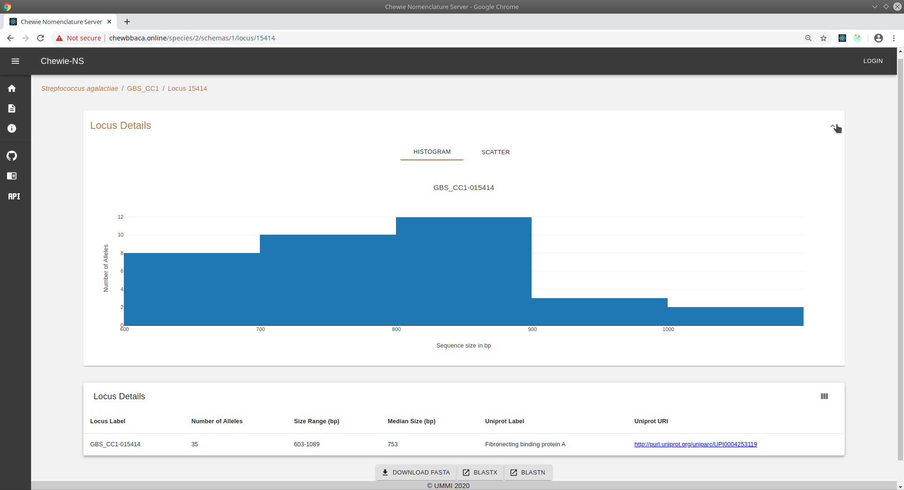
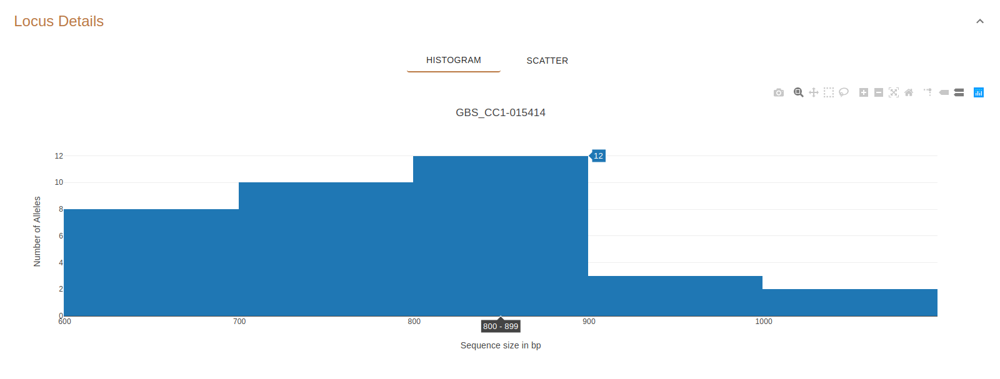
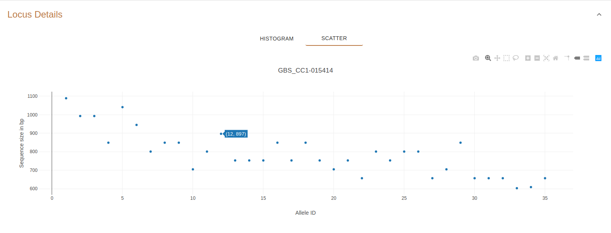
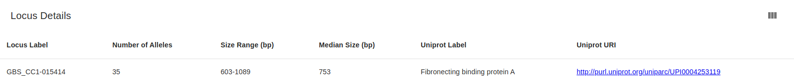

Locus Details
=============

This page displays details about a single locus.

.. note::
    The Locus Details panel is **by default expanded**. It can be collapsed by clicking on the **arrow icon** on the
    upper-right corner of the panel.

    Figure 1: Locus Details page.

Histogram
---------

The histogram represents the **number of alelles (y-axis)**
having a **length within a given range (x-axis)**.

For example, **Figure 2** shows that 744 alleles of locus INNUENDO_cgMLST-016801
vary in length between 5595 and 5599 base pairs (bp).

    Figure 2: Number of alleles (744) that have a length in the range of 5595-5599 (bp).

Scatter
-------

The scatterplot represents the **sequence size in base pairs (y-axis)** of **each 
allele (x-axis)** of the locus.

For example, **Figure 3** shows that allele 1877 of locus INNUENDO_cgMLST-016801 has a length of of 5232 base pairs.

    Figure 3: Length (5232 bp) of allele 1677.

Details table
-------------

The locus details table displays the following information about the locus:

- **Locus Label**: the Chewie-NS label assigned to the locus.
- **Number of Alleles**: the total number of alleles of the locus.
- **Size Range (bp)**: the range of sequence lengths of the alleles in base pairs.
- **Median Size**: the median of the allele lengths in base pairs.
- **Uniprot Label**: the Uniprot annotation.
- **Uniprot URI**: the URI of the Uniprot annotation. Clicking on the URI will open the page of the Uniprot annotation.

    Figure 4: Locus Details table.

Interactive Buttons
-------------------

Below the Locus Details table, there are 3 buttons |buttons| allowing the following operations:

- **Download FASTA**: downloads a FASTA file of the locus.
- **BLASTX**: opens a `BLASTX <https://blast.ncbi.nlm.nih.gov/Blast.cgi?PROGRAM=blastx&PAGE_TYPE=BlastSearch&LINK_LOC=blasthome>`_ webpage with the sequence of allele 1 already introduced in the search box.
- **BLASTN**: opens a `BLASTN <https://blast.ncbi.nlm.nih.gov/Blast.cgi?PROGRAM=blastn&PAGE_TYPE=BlastSearch&LINK_LOC=blasthome>`_ webpage with the sequence of allele 1 already introduced in the search box.

   
.. |buttons| image:: /resources/locus_details_buttons.png
    :align: middle
    :scale: 80%

.. note::
    The BLAST search will only occur if the first allele of the selected locus has a **sequence length < 8000 bps**.
    If an allele has more than 8000 bps, the following warning will appear.

    .. figure:: ../resources/sequence_alert.png
        :align: center
    
    In this case you should download the fasta file with the allele sequences and perform the query using your favorite interface.
