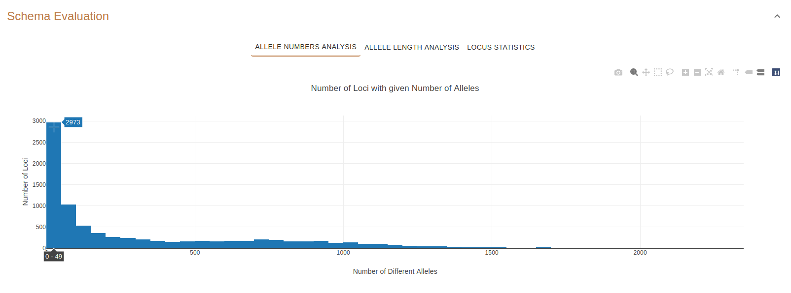

Schema Evaluation and Annotation
================================

This page displays details about a single schema.

Parameters table
----------------

The `chewBBACA <https://github.com/B-UMMI/chewBBACA>`_ parameter table
is the same as the one described on the :doc:`schema_overview`.

Schema Evaluation
-----------------

The Schema Evaluation box contains 3 plots displaying basic statistics about the schema.
The plots are displayed by clicking on the corrresponding buttons.

Allele Numbers Analysis
^^^^^^^^^^^^^^^^^^^^^^^

In this plot, **hovering** above the bars will show **how many loci (y-axis)**
contain a **number of different alleles (x-axis)**.

For example, **Figure 1** shows that 935 loci contain 1 allele.

    Figure 1: Number of loci (935) that contain 1 allele.

**Figure 2** shows that 632 loci contain 2 alleles.

.. figure:: ../resources/allele_numbers_fig2.png
    :align: center

    Figure 2: Number of loci (632) that contain 2 alleles.

Allele Length Analysis
^^^^^^^^^^^^^^^^^^^^^^

In this plot, **hovering** above the bars will display the **distribution of
allele mode size (x-axis)** contained by a **number of loci (y-axis)**.

For example, **Figure 3** shows that 326 loci have an allele mode size of 200 to 299 base pairs.

.. figure:: ../resources/allele_len.png
    :align: center

    Figure 3: Number of loci (326) that have an allele mode size 200-299 (bp).

   
Locus Statistics
^^^^^^^^^^^^^^^^

This plot displays locus statistics such as the **mean**, **median** and **mode** of each locus.

The **x-axis** represents the **number of alleles contained in each locus** while the 
**y-axis represents the size of the alleles in base pairs**.

For example, **Figure 4** shows that Locus 15441 has more than 60 alleles (y-axis) and 
the allele size is between 2000-3000 base pairs.

.. important:: **Clicking** on the plot's data points will take you the :doc:`locus_details` page of that locus!

.. figure:: ../resources/locus_statistics.png
    :align: center

    Figure 4: Locus 15441 statistics.
   

Annotations 
-----------

The annotations table contains annotations for each locus of the schema.

The columns of the table are the following:

- **Uniprot Label**: the Uniprot annotation.
- **Uniprot URI**: the URI of the Uniprot annotation. Clicking on the URI will open the page of the Uniprot annotation.
- **Locus ID**: the ID of the locus. Clicking on the ID will take you to the :doc:`locus_details` page.
- **Locus Label**: the Chewie-NS label assigned to the locus.
- **Total Number of Alelles**: the total number of alleles of that locus.
- **Alleles Mode**: the mode of the size of alleles.

.. figure:: ../resources/annotations_table.png
    :align: center

    Figure 5: Annotations table.

   
