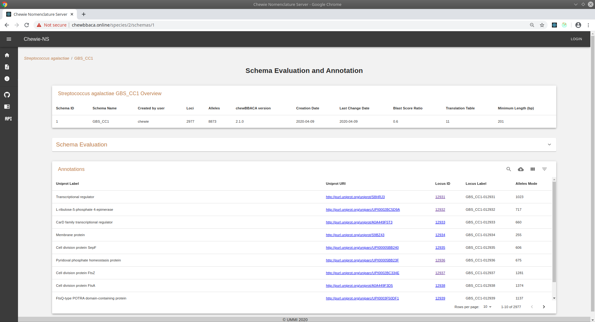
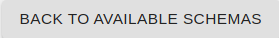
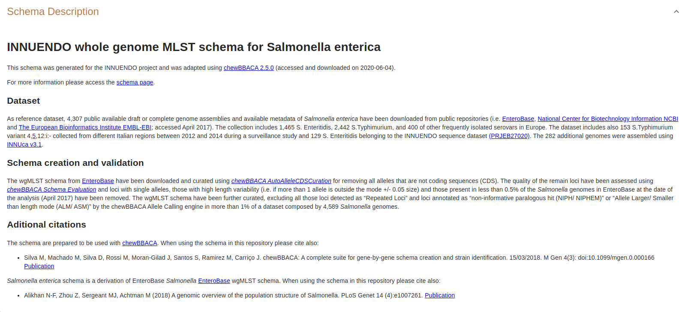
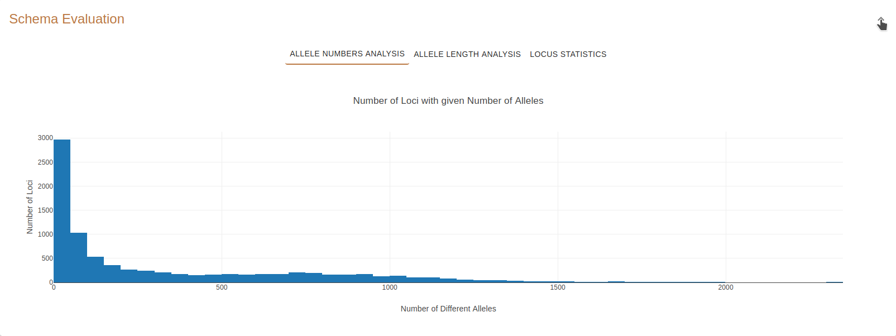
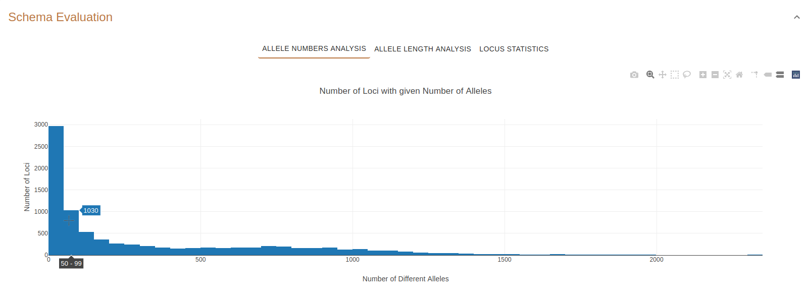
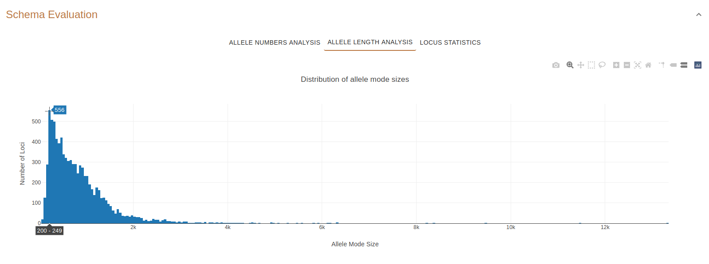
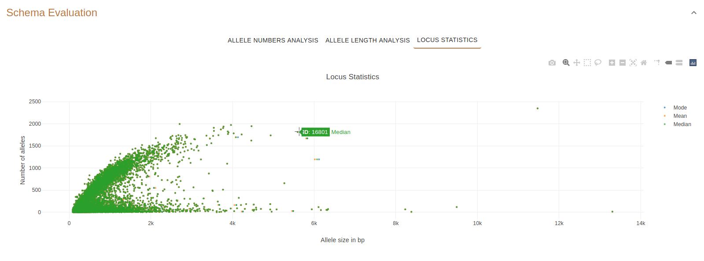
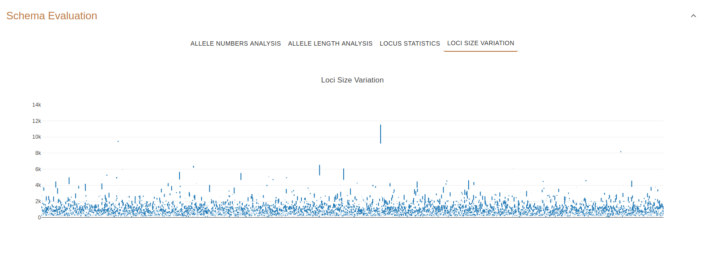
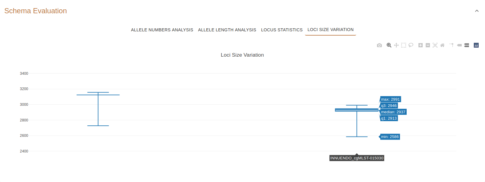
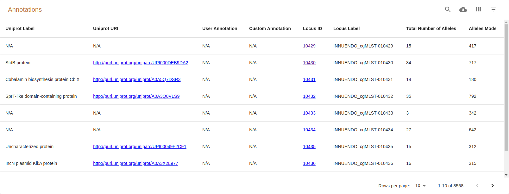

Schema Evaluation and Annotation
================================

This page displays details about a single schema. It also contains a button |back| to return to the :doc:`schemas` page.

    Figure 1.1: Schema Evaluation and Annotation page.

Parameters table
----------------

The `chewBBACA <https://github.com/B-UMMI/chewBBACA>`_ parameter table
is the same as the one described on the :doc:`schema_overview`.

Schema Description
------------------

The Schema Description panel contains the description of the schema
provided by the user (in Markdown format) during the schema upload.

If the user does not provide a description file, the name of the schema
will be used as the schema description.

An example file is available at 
`Chewie-NS' repository <https://github.com/B-UMMI/Chewie-NS/blob/master/docs/example_files/markdown_example.md>`_.

For more information on the Markdown specification accepted by Chewie-NS please visit the
`Github Flavored Markdown Specification page <https://github.github.com/gfm/>`_.

.. note::
    The Schema Description panel is **by default expanded**. It can be collapsed by clicking on the **arrow icon** on the
    upper-right corner of the panel.

    Figure 2.1: Schema Description panel.

Schema Evaluation
-----------------

The Schema Evaluation panel contains 4 plots displaying basic statistics about the schema.
The plots are displayed by clicking on the corrresponding buttons.

.. note::
    The Schema Evaluation panel is **by default expanded**. It can be collapsed by clicking on the **arrow icon** on the
    upper-right corner of the panel.

    Figure 3.1: Expanded Schema Evaluation panel.

    Figure 3.2: Collapsed Schema Evaluation panel.

Allele Numbers Analysis
^^^^^^^^^^^^^^^^^^^^^^^

In this plot, **hovering** above the bars will show **how many loci (y-axis)**
exibit a **number of different alleles (x-axis)** within the range shown.

    Figure 4.1: Number of loci (1030) that contain between 50 and 99 alleles.

Allele Length Analysis
^^^^^^^^^^^^^^^^^^^^^^

In this plot, **hovering** above the bars will display the **number of loci (y-axis)**
having an **allele mode size (x-axis)** within the range shown.

    Figure 5.1: Number of loci (556) that have an allele mode size in the range 200-249 (bp).

   
Locus Statistics
^^^^^^^^^^^^^^^^

This plot displays the number of alleles, the **median**  and the **size range (minimum and maximum)** of the length of each locus.

The **y-axis** represents the **number of alleles in the locus** while the 
**x-axis** represents the **median**  and the **size range (minimum and maximum) of the length of the alleles in base pairs**.

For example, **Figure 8** shows that Locus 16801 has more than 1500 alleles (y-axis) and 
that the central tendency measures of allele length are similar are over 5500 base pairs.

.. important:: **Clicking** on the plot's data points will take you the :doc:`locus_details` page of that locus!

    Figure 6.1: Locus 16801. Clicking on this point will open a page with the details of locus 16801.

Loci Size Variation
^^^^^^^^^^^^^^^^^^^

This plot displays the size variation of all the loci in the schema.

The **y-axis** represents the **central tendency measures of the length of the alleles in base pairs**
and the **x-axis** represents the each loci.

.. important:: **Clicking** on the plot's data points will take you the :doc:`locus_details` page of that locus!

    Figure 7.1: Loci size variation overview.

    Figure 7.2: Locus 15030. Clicking on this point will open a page with the details of locus 15030.

Annotations 
-----------

The annotations table contains annotations for each locus of the schema.

The columns of the table are the following:

- **Uniprot Label**: the Uniprot annotation.
- **Uniprot URI**: the URI of the Uniprot annotation. Clicking on the URI will open the page of the relevant Uniprot annotation.
- **User Annotation**: an annotation provided by the user during the schema upload.
- **Custom Annotation**: a custom annotation also provided by the user during the schema upload.
- **Locus ID**: the ID of the locus. Clicking on the ID will take you to the :doc:`locus_details` page.
- **Locus Label**: the Chewie-NS label assigned to the locus.
- **Total Number of Alelles**: the total number of alleles of that locus.
- **Alleles Mode**: the mode of the size of alleles.
- **Size Range (bp)**: the range of sequence lengths of the alleles in base pairs.

    Figure 8.1: Annotations table.

   
