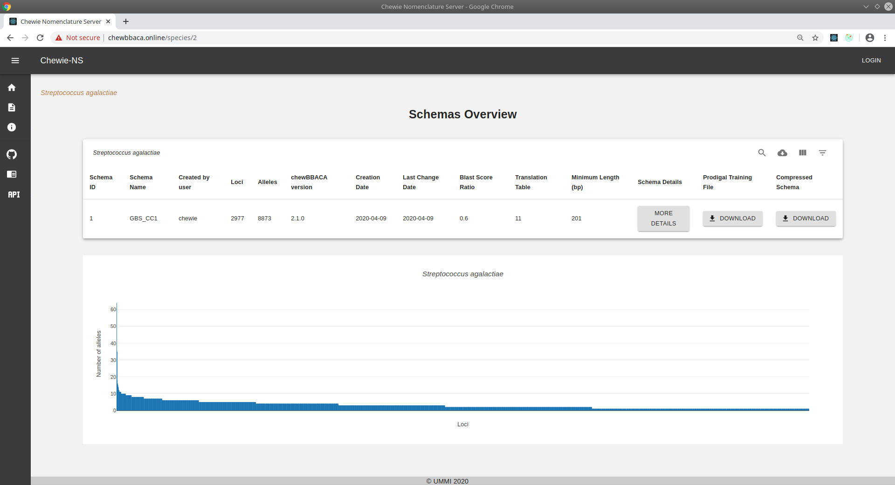
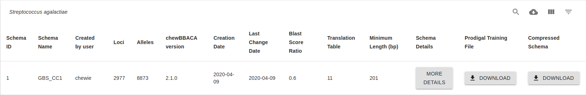
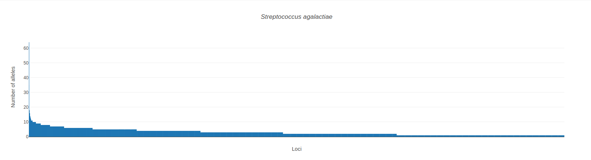
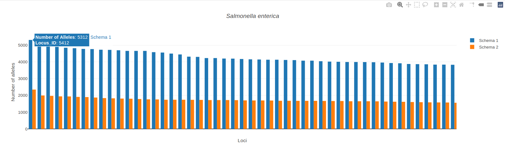

Schema Overview
===============

This page displays all schemas available for a single species.

    Figure 1: Schema Overview page.

Parameters table
----------------

The `chewBBACA <https://github.com/B-UMMI/chewBBACA>`_ parameters used
to create each schema are displayed on the following table:

    Figure 2: Parameters table.

The top-right buttons |buttons| of the table allow the user to:

- **Search** for a particular schema on the table.
- **Download CSV** will download the table in .csv format.
- **View Columns** allows users to select which columns are displayed.
- **Filter Table** provides filtering options. 

The parameters displayed on the table are the following:

- **Schema ID**: the ID Chewie-NS assigned to the schema.
- **Schema Name**: name of the  schema.
- **Created by user**: username of the schema creator.
- **Loci**: the total number of loci of the schema.
- **Alleles**: the total number of alleles of the schema.
- **chewBBACA version**: the version of `chewBBACA <https://github.com/B-UMMI/chewBBACA>`_ used to generate the schema.
- **Creation Date**: the creation date of the schema.
- **Last Change Date**: the date of the latest schema modification.
- **Blast Score Ratio**: the `Blast Score Ratio <https://bmcbioinformatics.biomedcentral.com/articles/10.1186/1471-2105-6-2>`_ used to generate the schema.
- **Translation Table**: the `translation table <https://www.ncbi.nlm.nih.gov/Taxonomy/Utils/wprintgc.cgi>`_ used to generate the schema.
- **Minimum Length (bp)**: the minimum coding sequence (CDS) length (bp) used to generate the schema.
- **Schema Details**: clicking on this button will take you the Schema Evaluation and Annotation page.
- **Prodigal Training File**: Click on this button to download the prodigal training file used to generate this schema.
- **Compressed Schema**: Click on this button to download the compressed (.zip) schema.

Schemas plot
------------

The following barplot displays all the schemas described in the above table, showing
the number of alleles (y-axis) and the distribution of loci (x-axis).

    Figure 3:

.. important:: 
    Each bar represents a locus and by **hovering** them a popup will display the **locus ID** and the **number of alleles** of that locus.
    Moreover, **if you click on the bar** you will be redirected to the :doc:`locus_details` page.

    Figure 4: Plot bars display the Locus ID and the number of alleles. 

