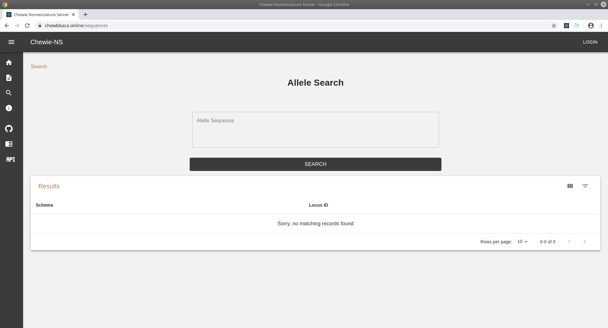
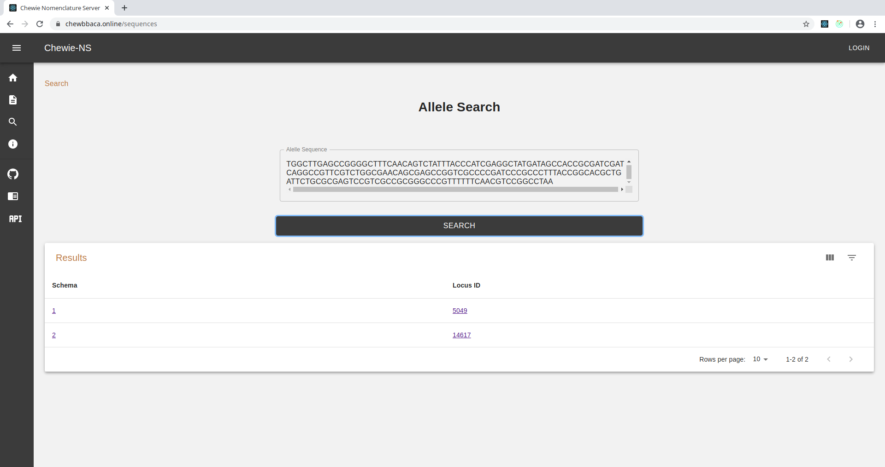

Search
======

The **Search** button on the sidebar will take the user to a page where one can search for alleles in the Chewie-NS databases using a given nucleotide sequence.

Searching for an allele
-----------------------

In order to search for an allele, the user needs to fill the **Allele Sequence** box
with the **DNA sequence** of the allele.

.. important:: You can only search for **one** allele at a time. Only exact matches will be found.

    Figure 1: Empty Allele Sequence box. 

By default when that particular sequence not exist in any Chewie-NS database, a table 
is rendered with a message indicating that no matches were found.

**If the allele exists** in the Chewie-NS database, the table will contain the following columns:

- **Species**: the name of the species that the allele sequence belongs to.
- **Schema**: the ID of the schema the allele corresponding to that sequence belongs to. Clicking on the Schema ID will take you to the :doc:`schema_evaluation` page.
- **Locus ID**: the ID of the locus the allele corresponding to that sequence belongs to. Clicking on the Locus ID will take you to the :doc:`locus_details` page.
- **Number of alleles**: the number of alleles of the loci the sequence matched to.

    Figure 2: Allele Sequence box with a sequence that matched two loci in different schemas. This could be because there are two schemas for the same species containing the same allele.
