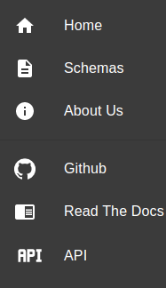

Sidebar
=======

Hovering over the sidebar menu |menu|, or over each element,
will open a sidebar contaning six buttons:

Home
----

**Home** will redirect to Chewie-NS's homepage.

Schemas
-------

**Schemas** will take to a page displaying all available :doc:`schemas`.

About Us
--------

**About Us** contains a brief description of Chewie-NS and
contributions for the development of the service.

Github
------

**Github** will take to Chewie-NS's Github repository.

Read the Docs
-------------

**Read the Docs** will take to this documentation's index.

API
---

**API** will take you to Chewie-NS's `API <https://194.210.120.209/api/NS/api/docs>`_.
