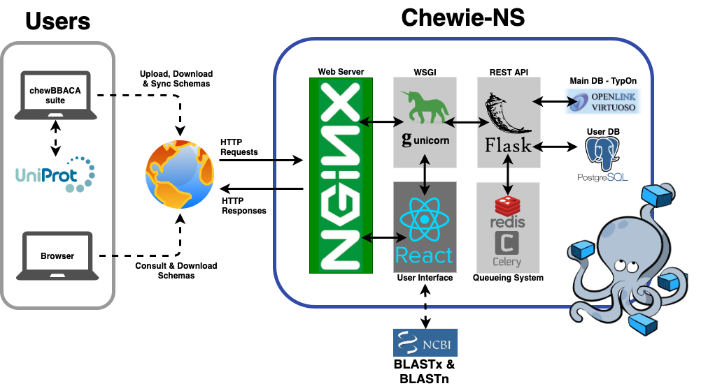
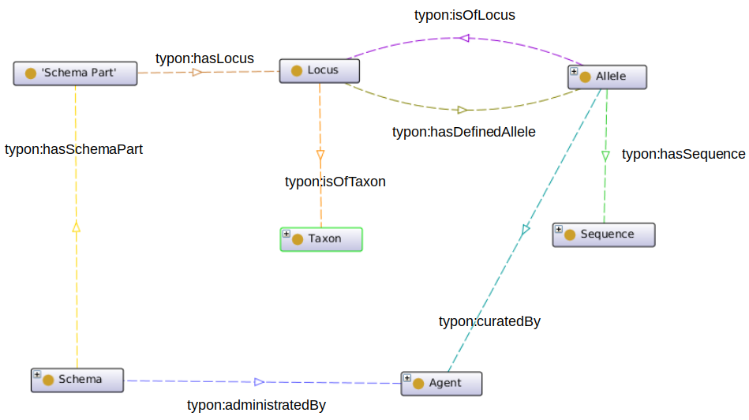

Overview
========

Chewie-NS is a Nomenclature Server based on the 
`TypOn ontology <https://jbiomedsem.biomedcentral.com/articles/10.1186/2041-1480-5-43>`_ 
that integrates with `chewBBACA <https://github.com/B-UMMI/chewBBACA>`_ 
to provide a centralized service to share and update gene-by-gene schemas, 
allowing the easy sharing of results, while ensuring the reproducibility and 
consistency of these steps.

A diagram of the implementation of Chewie-NS is displayed below:

    Figure 1.1: Chewie-NS implementation.
   

Motivation
----------

Current typing methods suffer from standardization issues that become clear when 
trying to compare results from distinct tools but, most importantly, when a 
meaningful comparison is needed between results obtained with the same tool.

We have previously proposed a suite, `chewBBACA <https://github.com/B-UMMI/chewBBACA>`_, 
that allows the creation of gene-by-gene schemas and the determination of allelic 
profiles from genome assemblies. The results obtained using this suite may 
not be immediatly comparable due to the use of different argument values that hinder 
the comparison and shareability of the results.

To tackle these issues we developed Chewie-NS, which provides a centralized service to manage
gene-by-gene typing schemas and a common nomenclature for allele calling, ensuring the
reproducibility of the analyses and the privacy of the data.

Implementation
--------------

Chewie-NS provides a public and centralized web service, separated into 
a backend component that handles command line and server requests and a frontend component that 
allows a user-friendly interaction with the service.

Backend
:::::::

The backend of the service uses Virtuoso, a triple store database management system,
based on the `TypOn ontology <https://jbiomedsem.biomedcentral.com/articles/10.1186/2041-1480-5-43>`_.

    Figure 2.1: TypOn ontology. Adapted from `Vaz et al, 2014 <https://jbiomedsem.biomedcentral.com/articles/10.1186/2041-1480-5-43>`_.

A `REST API <https://restfulapi.net/>`_, built with `Flask <https://flask.palletsprojects.com/en/1.1.x/>`_, 
a Python web development microframework, is available to allow users to interact 
with the Virtuoso database. It also facilitates the integration with `chewBBACA <https://github.com/B-UMMI/chewBBACA>`_ 
to support the development of modules that will handle schema upload, download and 
synchronization from the command line.

Frontend
::::::::

A user-friendly interface, built using the `ReactJS <https://reactjs.org/>`_ web 
framework, simplifies access for all types of users, providing a listing 
of available schemas per species and displaying relevant schema and loci statistics. 
Access to compressed versions of the available schemas is available, 
allowing their direct download for local use.

The main instance of Chewie-NS is available at `chewbbaca.online <https://chewbbaca.online/>`_.

Data Privacy
------------

Chewie-NS provides a distinct approach when compared with other publicly available 
web services due to its' integration with `chewBBACA <https://github.com/B-UMMI/chewBBACA>`_, which enables local 
analyses and has the potential to considerably expedite the generation of results, while 
also **providing the option to share newly identified alleles** still respecting data 
privacy and ownership concerns.
