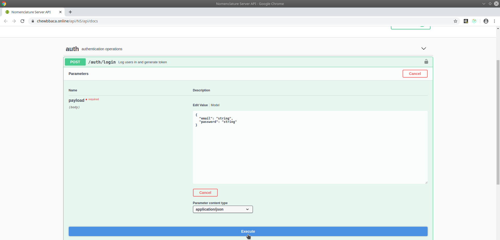
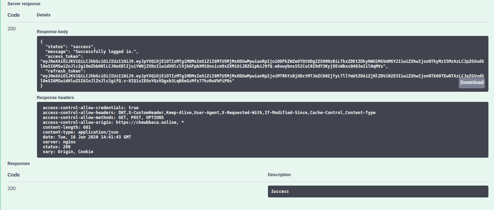
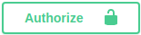
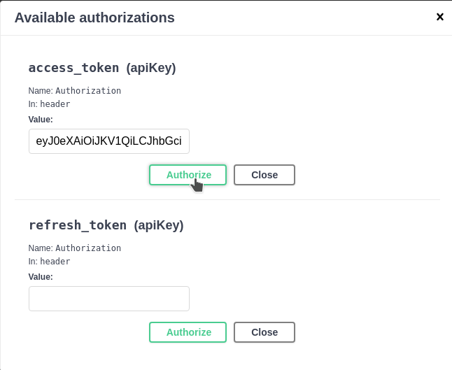
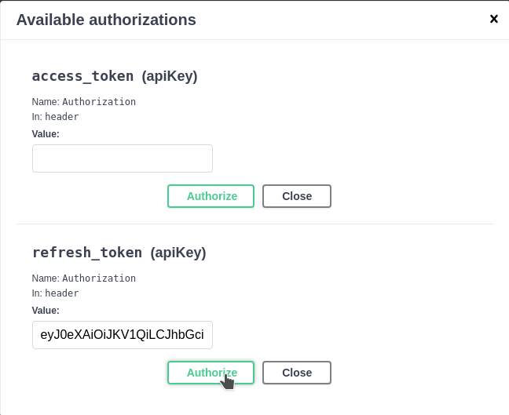
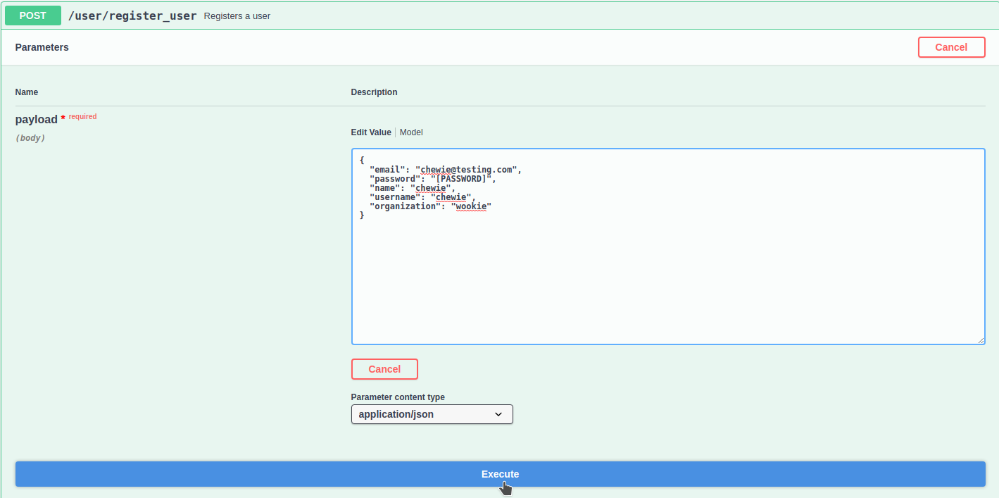

User Management
===============

For local instances of Chewie-NS user management is performed through the use
of the **auth** and **user** namespaces.

Admin authentication
--------------------

The **user** namespace operation can only be performed with a valid token
from an admin user. 

To authenticate you need to access the **auth/login** tab and click on the **Try it out** button 
on the top-right corner to be able to edit the JSON payload.

Fill the email and password fields with the credentials for the admin user and click on the **Execute** button below.

    Figure 1.1: Admin user authentication.

If the creadentials are correct Chewie-NS will return a response containing a message informing
the user that the authentication was successful and, more importantly, it will return an 
**access token** and **refresh token**.

    Figure 1.2: Successful authentication response with tokens.

Access token 
^^^^^^^^^^^^

The access token will allow the user to access endpoints that require specific permissions, such 
as POST endpoints, because the token contains the user information necessary to allow the operation.

TO send the **token** in all requests after authentication, the user needs to copy the token 
from the authentication response and paste it in the authorize button |authButton| at the top
right corner of the Swagger documentation page.

    Figure 2.1: Access token field with the pasted token.

Refresh token
^^^^^^^^^^^^^

By default access tokens have an **expiry period of 3 hours** (which can be modified in Chewie-NS's configurations)
and after that time a new toke must requested to from Chewie-NS.
This is when the **refresh token** comes in, as it allows the user to request a new access token.

The process is very similar to the access token refered above, as it requires the user to copy the
**refresh token** from the authentication response and paste it in the authorize button at the top
right corner of the Swagger documentation page.

.. note:: The expiry period of refresh tokens is 30 days. This setting can also be configured in Chewie-NS's configurations.

    Figure 3.1: Refresh token field with the pasted token.

After pasting the refresh token in the authorize button, the user simply needs to access the **auth/refresh**
endpoint and press the **Execute** button.

.. figure:: ../resources/user_auth_new_access_token.png
    :align: center

    Figure 3.2: New access token obtained from the refresh endpoint.

User operations
---------------

After the authentication admin users can access the user management
endpoints in the **user** namespaces.

/user/current_user
^^^^^^^^^^^^^^^^^^

This endpoint will return information about the user that is currently logged in.
The information obtained in the response is the following:

- **id**: The internal ID of the user.
- **email**: The email of the user.
- **name**: The name of the user.
- **username**: The username of that will be associated with the schema upload.
- **organization**: The organization the user belongs to.
- **last_login_at**: The datetime of the last login.
- **roles**: The role associated to the user. Can only one of, User, Contributor or Admin.
- **validated**: A boolean that shows if the account has been validated.

/user/register_user
^^^^^^^^^^^^^^^^^^^

This is the endpoint used by the user interface to register new users.
To register a user, the admin must fill the required fields of the payload
and click on the **Execute** button.

    Figure 4.1: Register user endpoint.

/user/users
^^^^^^^^^^^

This endpoint will return a list with all registered users and the information refered above about each one.

/user/{id} GET
^^^^^^^^^^^^^^

This endpoint will return the information refered above about a **single** user.
It is required to provide the user id to access the information.

/user/{id} DELETE
^^^^^^^^^^^^^^^^^

This endpoint will delete a user from Chewie-NS's database if the user has requested it beforehand.

To delete a user, the admin only needs to provide the user id.

/user/{id} PUT
^^^^^^^^^^^^^^

This endpoint allows admins to promote a role a user to **Contributor**, providing the promoted user
access to endpoints that are able to modify the database.

Once again, provide the user id to promote the user.
