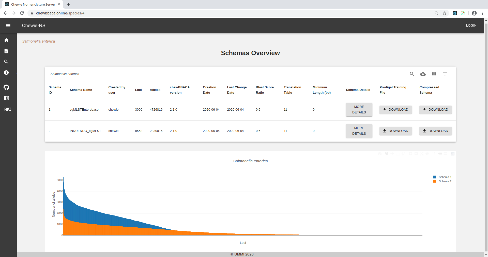
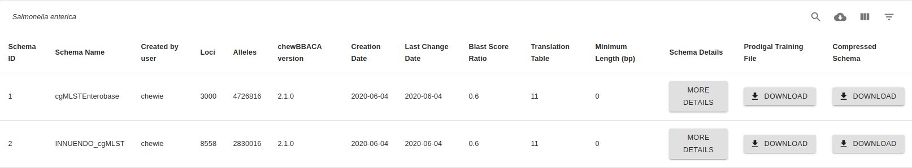
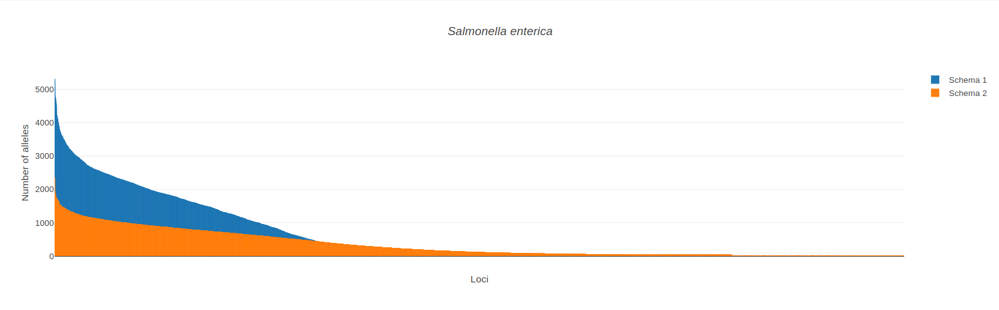
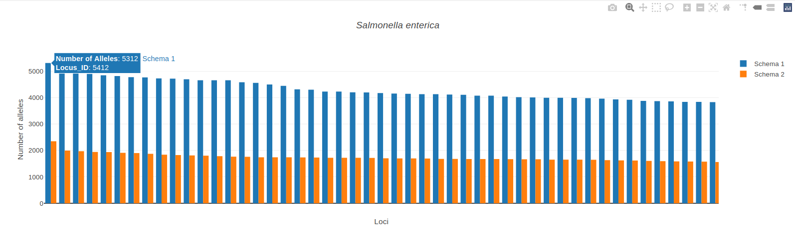

Schema Overview
===============

This page displays information on all schemas available for a given species. It also contains a button |back| to return to the :doc:`schemas` page.

    Figure 1.1: Schema Overview page.

Parameters table
----------------

The `chewBBACA <https://github.com/B-UMMI/chewBBACA>`_ parameters used
to create each schema are displayed on the following table:

    Figure 2.1: Parameters table.

The top-right buttons |buttons| of the table allow the user to:

- **Search** for a particular schema on the table.
- **Download CSV** will download the table in .csv format.
- **View Columns** allows users to select which columns are displayed in the table.
- **Filter Table** provides filtering options. 

The parameters displayed on the table are the following:

- **Schema ID**: the ID Chewie-NS assigned to the schema (it is a numerical value attributted automatically).
- **Schema Name**: name of the schema as provided by the user.
- **Created by user**: username of the schema creator (created when the user registered in the website).
- **Loci**: the total number of loci in the schema.
- **Alleles**: the total number of alleles in all the loci of the schema.
- **chewBBACA version**: the version of `chewBBACA <https://github.com/B-UMMI/chewBBACA>`_ used to generate the schema.
- **Creation Date**: the creation date of the schema in the platform.
- **Last Change Date**: the date of the latest schema modification.
- **Blast Score Ratio**: the `Blast Score Ratio <https://bmcbioinformatics.biomedcentral.com/articles/10.1186/1471-2105-6-2>`_ used to generate the schema.
- **Translation Table**: the `translation table <https://www.ncbi.nlm.nih.gov/Taxonomy/Utils/wprintgc.cgi>`_ used to generate the schema.
- **Minimum Length (bp)**: the minimum coding sequence (CDS) length (bp) to be considered as a locus in the schema.
- **Schema Details**: clicking on this button will take you to the :doc:`schema_evaluation` page showing more details on each schema.
- **Prodigal Training File**: Click on this button to download the prodigal training file used to generate that particular schema.
- **Compressed Schema**: Click on this button to download a compressed (.zip) version of the schema to use locally.

Schemas plot
------------

The following barplot displays all the schemas described in the above table, showing
each individual locus (x-axis), ordered by decreasing number of alleles in each locus, and the number of alleles (y-axis). You can zoom into a particular region of the chart by clicking and dragging on the region of interest.

    Figure 3.1: Bar plots for available schemas.

.. important:: 
    Each bar represents a locus and by **hovering** on a bar, a popup will display the **locus ID** and the **number of alleles** of that locus.
    Moreover, **if you click on the bar** you will be redirected to the :doc:`locus_details` page where additional information of that locus will be presented.

    Figure 3.2: Plot bars display the Locus ID and the number of alleles. 

