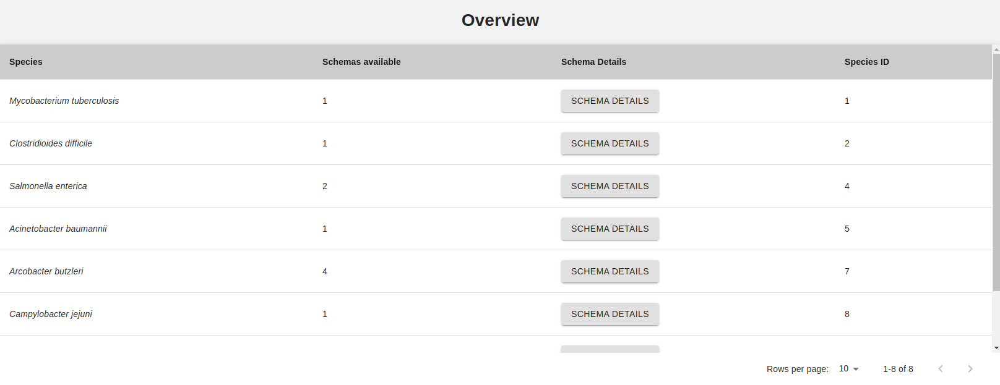

Schemas
=======

The **Schemas** button on the sidebar is the entrypoint to explore the schemas available in Chewie-NS.

Summary table
-------------

The **Summary** page displays a table summarizing all the species present in Chewie-NS and information on how many schemas are available for each.

Clicking on the **Schema Details** button will take to the :doc:`schema_overview` page where more detailed information on the schemas of each species is presented.
